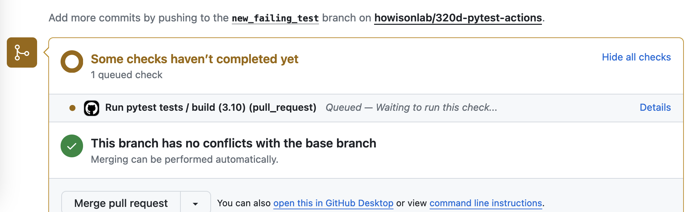
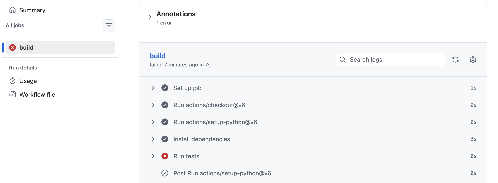
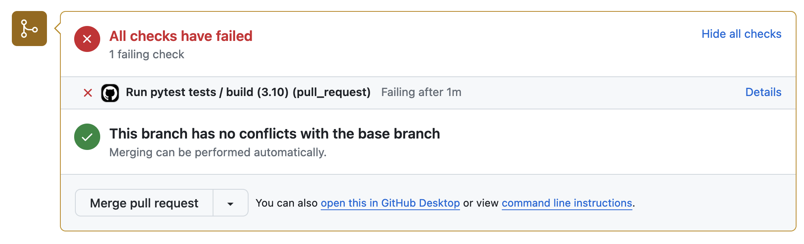
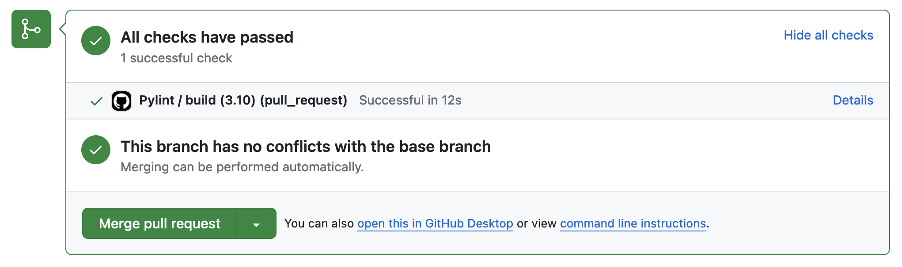
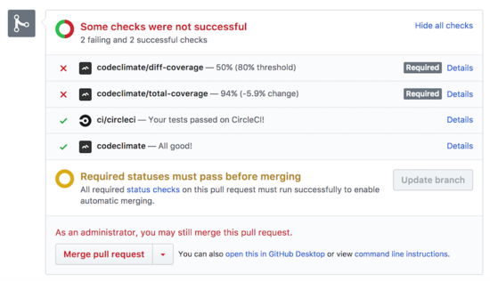

# Continuous Integration (aka CI/CD) {#sec-ci}

**Continuous Integration** encourages frequent merging of developing code, running the test suite to ensure that nothing is merged to main unless all the tests pass. 

Continuous integration helps a project to stay synchronized, achieving coordination by managing dependencies between activities.  Some of the sources of change that can cause issues for projects are:

1. **Parallel development**:  When developers are working in parallel, their work can become de-synchronized.  We discussed merges and rebase as approaches to re-synchronizing, but even with those sources of help when work is separate for longer periods of time misunderstandings can result.  Small changes, frequently merged, are also easier for other developers to understand.
2. **Changes in the package ecosystem**: Packages that the project is built on top of changing over time, new versions or security updates.
3. **Regressions** Where bugs that were dealt with reoccur after changes. Regressions happen because, despite a fix, the situation that created the bug in the first place continues. For example, that might be due to the logic or architecture creating common misunderstandings, or having complex special cases that interact in ways that are hard for developers to keep in their mind as they program.

Projects accomplish Continuous Integration by:

1. Having policies that encourage small units of work (sometimes known as "atomic commits" using the idea of an atom as a particularly small building block.).  An example of a policy would be requiring formal code review as part of a PR, where one criteria being examined is whether the PR could be split into smaller units of work.
2. Automatically running test suites.

In this class we will focus on automatically running test suites. In @sec-tests we introduced a test framework called `pytest`. Recall that we created new functions whose name begins with `test_` and includes `assert` statements that run code and compare actual output with expected output. When they don't match, the test fails.  Here is our example of a test:

```python
def test_fix_phone_num():
  assert fix_phone_num("5125558823") == '(512) 555 8823'
```

To achieve continuous integration, we want to be sure that all of these tests are run automatically before any code is merged. When we merge, git and GitHub can tell us if the merge would case any syntax issues (whether the code merges cleanly at a typing level), but only a test suite can tell us if code will merge cleanly at a semantic level (if the resulting code will perform as we expect).

## Automating tests

To run these tests we need to undertake these steps:

1. Establish a computing environment in which the code can run.
2. Install the code from the project **as though the PR had been accepted**  (see FAQ: @sec-fetch-pr)
3. Install any dependencies that the project needs
4. Run the needed test command (here that will be `pytest my_code.py`)
5. Gather the results, and display them alongside the PR.

These steps can be undertaken by quite a few different systems. We will learn using GitHub Actions, but see @sec-alt-ci for alternatives. 

## Github Actions

Github Actions is a GitHub feature that enables automation in repositories, including continuous integration.

To establish an automation we have to add a file to the repository, in the `.github/workflows` directory on the main branch. This file is automatically discovered by GitHub Actions and tells it what to do when particular events occur.

In this case we'll call it `pytest.yml` since we want to run pytest to test code changes. The format here is yaml, which is a configuration format where indentation matters like Python, but uses colons and dashes for configuration variables.

```yaml
name: Run pytest tests

on: 
  pull_request:
    branches: [ main ]
```

The first part of the file (shown above) provides a name for the workflow (`Run pytest tests`) and establishes a trigger for the workflow to be run.  Here we specify that we want this workflow to run whenever there is a `pull_request` to the `main` branch (thus covering the usual situation for PRs).

Then next parts of the file layout the abstract steps as shown above:

First we establish the operating system for the test runner virtual machine.  Here we say that we want to use `ubuntu-latest` (which is a flavor of unix).

```yaml
jobs:
  build:
    runs-on: ubuntu-latest
```

Then we specify that we want to checkout the code for the PR. Github Actions allows us to refer to chunks of code defined by GitHub. This is just like using a function from a library (where the `uses` command gives the name of the function and the `with` block provides parameters)

```yaml
    steps:
    - uses: actions/checkout@v6
```

Then we actually install the needed version of python.

```yaml
    - uses: actions/setup-python@v6
      with:
        python-version: '3.12' 
```

Then we install any needed dependencies (here we just check that pytest is installed)

```yaml
    - name: Install dependencies
      run: |
        python -m pip install --upgrade pip
        pip install pytest pytest-md pytest-emoji
```

Finally we run pytest in verbose mode against our test file.

```yaml
    - name: Run tests
      run: pytest fix-phone-num.py -v
```

The `-v` flag gives verbose output so we can see each individual test's pass or fail status, just as we would when running pytest locally. If any test fails, pytest exits with a non-zero status code, which GitHub Actions interprets as a failure — that's what produces the red X on the PR.

::: {.callout-note}
On larger projects you may see nicely formatted test summaries with emoji and tables on the Actions summary page. These are produced by third-party actions (such as `pavelzw/pytest-action` or `pmeier/pytest-results-action`) that write markdown to a special file called `$GITHUB_STEP_SUMMARY`. For our purposes the pytest log output and the pass/fail status on the PR are all we need.
:::

## Full yaml file

Together, then the file looks like:

```yaml
name: Run pytest tests

on: 
  pull_request:
    branches: 
      - main

jobs:
  build:
    runs-on: ubuntu-latest
    steps:
    - uses: actions/checkout@v6
    - uses: actions/setup-python@v6
      with:
        python-version: '3.12' 
    - name: Install dependencies
      run: |
        python -m pip install --upgrade pip
        pip install pytest
    - name: Run tests
      run: pytest fix-phone-num.py -v
```

## Implementing with GitHub Actions

Once we place the full file into our repo in the special `.github/workflows/pytest.yml` location, then GitHub will see the file and add this new check to a new PR when it is opened.



If you click on the "Details" link you move over to the Actions tab and, once the test run is complete (time seems to vary, usually it is very fast), you will see the Summary details.



If you look deeper into the "Run tests" section you can see the output of `pytest my_code.py` just as we would have seen it run on the commandline.


The PR page itself will now show that a check has failed (or it might still show the check in progress).  



To fix the failing test, you need to edit the files to either remove the new test or make it pass, add, commit, and push that new commit into the branch for the PR.  This will cause the tests to run again, and (if all tests now pass) you will see:



One further step would be to add a code coverage test. These are a "test that there are tests" approach, which watches for changes in the proportion of lines that actually executive when tests are run.  pytest can do code coverage (using the pytest-coverage plugin) but there are also lots of additional tools and external services (some of which check for additional code quality measures as well).  Here as an example (from the commercial service [CodeClimate](https://docs.codeclimate.com/docs/workflow)).



## Exercise:

In this exercise we will go through the process of adding a pytest GitHub action to validate that accepted PRs do not cause tests to fail.
We will make a change to the `fix_phone_num` which will introduce a bug and cause the GitHub UI to show us that the test is failing,
and then fix the bug.

The intent of the change is to allow `fix_phone_num` to support cases where users have entered the country code at the start of their phone number (e.g. "15551239876" instead of "5551239876"), and still format the number properly (as `(555) 123 9876` in both cases).

1. Fork the [howisonlab/i320d-cicd-exercise](https://github.com/howisonlab/i320d-cicd-exercise) repository and clone it to your laptop.
1. Add the pytest GitHub action to your repo by adding a file at `.github/workflows/pytest.yaml` with the full workflow contents from above.
1. Commit this to your `main` branch and push to your repository.
1. Switch to a new branch.
1. Rename `fix-phone-num-buggy.py` to `fix-phone-num.py` This code has a bug which will cause tests to fail.
1. Commit and push those changes to GitHub.
1. Open a pull request **within your own repo, not upstream** to merge those changes into your `main` branch. Do not merge it yet.
1. Observe the test running from within the PR screen, and locate the test failure report.
1. Push a fix that makes the new tests pass (you'll need to create the fix yourself)
1. Observe the test running again, and your PR should now show "All checks have passed"

::: {.callout-tip}
If at any point you make a mistake and need to retrigger the checks on GitHub but don't need to make any changes to your file,
you can retrigger those checks with:

```
git commit -m "retrigger checks" --allow-empty
```

This creates an empty commit (normally Git refuses to create commits without any changes), which will re-prompt GitHub to run the pytest action.
:::


## Alternatives to GitHub actions {#sec-alt-ci}

It is possible to "roll your own" using a cloud provider like Google Cloud or AWS, but there are service providers ready to help, including GitHub and GitLab. Since running any computation (including just installing things) costs real money, these services typically charge money, but often will provide a free account with reasonable usage limits for open source projects [https://circleci.com/open-source/](https://circleci.com/open-source/). Yet as with anything that is provided for free (including Github Actions) [changes in corporate ownership can upend things](https://earthly.dev/blog/migrating-from-travis/) explaining one previously dominant service called TravisCI that is not anymore. 

